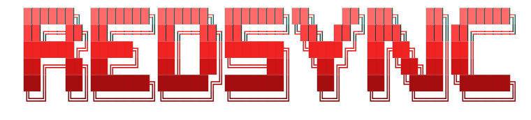

<div align="center">




### One binary. Many sources. Perfectly in sync.

RedSync merges Dolby Vision and HDR10 / HDR10+ into one MKV, syncs audio,
subtitles and chapters taken from different sources, and injects a DV RPU onto an
HDR10 base with the active-area crop worked out automatically. A single command
line tool for Linux and Windows.


</div>

---

RedSync is a command line tool for building Dolby Vision and HDR hybrid MKV files
and for syncing tracks across releases. It wraps `dovi_tool`, `hdr10plus_tool`,
`ffmpeg` and `mkvmerge` behind one command, measures audio offsets so tracks line
up, and keeps every language tag, title and flag intact.

Use it to:

- Add Dolby Vision to an HDR10 file (inject a DV RPU and produce a DV HDR10 / DV
  HDR10+ hybrid)
- Make a DV + HDR hybrid from a small DV rip and a full-size HDR10 video
- Combine a DV source and a separate HDR10+ source into one DV HDR10+ hybrid
- Convert HDR10+ to Dolby Vision
- Sync audio, subtitles or chapters from one release onto the video of another
- Remux tracks from several MKV sources into one file with correct timing
- Set the sync offset by hand when you already know it (`--shift`)
- Drive any of the above from a script and read the result back as JSON
  (`--json`)

## Contents

- [Install](#install)
- [Requirements](#requirements)
- [Quick start](#quick-start)
- [How to add Dolby Vision to an HDR10 file](#how-to-add-dolby-vision-to-an-hdr10-file)
- [How to sync audio from a different release](#how-to-sync-audio-from-a-different-release)
- [Scripting RedSync](#scripting-redsync)
- [How the sync stays accurate](#how-the-sync-stays-accurate)
- [How the hybrid crop is automatic](#how-the-hybrid-crop-is-automatic)
- [Build from source](#build-from-source)
- [Credits](#credits)

## Install

Download the binary for your platform from the
[releases page](https://github.com/720pixel/RedSync/releases) and run it. It is
self-contained and needs no admin rights.

**Linux**

```bash
chmod +x RedSync
./RedSync -h
```

**Windows (terminal)**

```powershell
.\RedSync.exe -h
```

Then check your tooling in one step:

```bash
RedSync doctor
```

## Requirements

RedSync calls a few external programs. Run `RedSync doctor` at any time to see
what is present and what is missing.

| Tool | How it is provided |
|------|--------------------|
| `dovi_tool`, `hdr10plus_tool` | Bundled inside the binary. Nothing to install. |
| `ffmpeg`, `ffprobe` | Fetched automatically on first run if not already on your system. |
| `mkvmerge`, `mkvextract`, `mkvpropedit` (MKVToolNix) | You install these. |
| `mediainfo` | You install this. |

Install the two you need:

**Linux (Debian / Ubuntu)**

```bash
sudo apt install mkvtoolnix mediainfo
```

Other distributions: `dnf install mkvtoolnix mediainfo` (Fedora),
`pacman -S mkvtoolnix-cli mediainfo` (Arch).

**Windows**

```powershell
winget install MoritzBunkus.MKVToolNix MediaArea.MediaInfo
```

If a tool is missing, `RedSync doctor` prints the exact command to fix it.

## Quick start

**Pick interactively.** Point at a folder and choose a version:

```bash
RedSync ./my-clips/
```

RedSync numbers each source, lists the versions you can build (with a
recommended best pick based on the highest video tier, best audio and most
subtitles), and lets you compose one with short codes: `v1` video from source 1,
`a2` audio from source 2, `s2` subtitles from source 2, `c1` chapters from
source 1, `dv2` Dolby Vision from source 2.

**Quick two-file sync.** First file is the video, the second hands over its
audio, subtitles and chapters:

```bash
RedSync film_a.mkv film_b.mkv --sync
```

Narrow it with `--audio-only`, `--subs-only` or `--chapters-only`.

**Pulling subtitles from more than one source?** Add `--unique` and RedSync
keeps one subtitle track per language/forced/SDH combination instead of
muxing every track from every source. Sources are deduped in the order
they're given, so nothing is lost - if source A has 4 subtitle languages and
source B has 8, and one of source A's languages isn't in source B at all,
that one still makes it into the output instead of being dropped in favor of
source B's larger set:

```bash
RedSync film_a.mkv film_b.mkv film_c.mkv --sync --unique
```

Region matters here too: a French track tagged `fr-CA` and one tagged `fr-FR`
count as different languages, not duplicates. RedSync reads that from
Matroska's BCP-47 language tag (mkvmerge's identify output), since plain
`ffprobe` collapses both down to a bare `fre`.

**Spell out three or more sources:**

```bash
RedSync --video film_a.mkv --audio film_b.mkv --subtitles film_c.mkv --chapters film_a.mkv
```

`--subs` / `--subtitles` and `--chapters` / `--chaps` are interchangeable.

**Inspect a file:**

```bash
RedSync analyze *.mkv
```

Add `--dry-run` to any command to print the plan and the exact `mkvmerge` line
without writing anything, and `--out-dir <folder>` to choose where the result is
written.

On a real hybrid run the layer extractions, the RPU work and the offset
measurement run in parallel, and the large intermediate files are deleted as soon
as they are used, so nothing piles up in the cache.

Every run ends with a timings breakdown - how long probing, offset
measurement, the hybrid build and the final mux each took, plus the total -
so it's obvious where the time actually went.

## How to add Dolby Vision to an HDR10 file

Take the HDR10 video and the Dolby Vision from two sources and build a DV HDR10
hybrid, keeping the HDR10 source's own audio, subtitles and chapters:

```bash
RedSync hybrid --hdr movie_hdr10.mkv --dv movie_dv.mkv
```

The DV source can be a smaller rip (for example 1080p Dolby Vision onto a 2160p
HDR10 base). The RPU is the same metadata at any resolution, and RedSync scales
the active-area crop to the base for you.

Turn an HDR10+ file into DV HDR10+ from a single source:

```bash
RedSync hybrid --hdr10plus movie_hdr10plus.mkv
```

**Combine a DV source and a separate HDR10+ source.** If you have one file with
Dolby Vision and a different file with HDR10+, RedSync can graft the HDR10+
dynamic metadata onto the DV video to make a DV HDR10+ hybrid:

```bash
RedSync hybrid --dv movie_dv.mkv --hdr10plus movie_hdr10plus.mkv
```

This keeps the **DV file's** video and borrows only the HDR10+ metadata, so the
DV RPU (and its active-area crop) is preserved untouched. It needs a DV source
that already carries an HDR10 base layer - profile 8.1 (or 7). A profile 5
source (typical of iTunes rips) is single-layer DV with no HDR10 base, so its
pixels can't stand in for HDR10; RedSync detects that and points you at the
other direction instead, which keeps the HDR10+ video and grafts the DV onto it:

```bash
RedSync hybrid --hdr movie_hdr10plus.mkv --dv movie_dv.mkv
```

Both directions produce a DV HDR10+ file - they differ only in which source's
video pixels survive.

Want only the elementary stream to mux yourself? Add `--hevc-only`.

## How to sync audio from a different release

```bash
RedSync --video keep_this_video.mkv --audio other_release.mkv
```

RedSync measures the real offset from the audio and applies it. If the two
releases run at different frame rates it corrects the drift with a linear factor
instead of a single delay that slips over time. Subtitles and chapters sync the
same way.

**Already know the offset?** Skip the measurement and set it yourself with
`--shift` (milliseconds, negative allowed). The value is applied as a constant
delay to every source being synced onto the video:

```bash
RedSync a.mkv b.mkv --sync --shift -320
```

## Scripting RedSync

Every command is non-interactive when you pass explicit flags, and `--json`
turns the result into a single machine-readable object on stdout while all the
decorative output stays on stderr - so a wrapping script can parse stdout
cleanly.

```bash
RedSync analyze --json *.mkv                       # tracks, fps, HDR/DV per file
RedSync doctor --json                              # tool availability + paths
RedSync hybrid --dv dv.mkv --hdr10plus hdr.mkv --json
RedSync a.mkv b.mkv --sync --json                  # output path, offsets, timings
```

A run's JSON reports the output filename, the final dynamic-range tag, the delay
(and any frame-rate stretch) measured for each source, the exact `mkvmerge`
command, and per-stage timings. Add `--dry-run` to get all of that without
writing anything, or `--quiet` to keep the pretty output but drop the spinners.

## How the sync stays accurate

The offset between two tracks comes from their audio. RedSync decodes a short
window from each, builds a log-mel energy envelope, and cross-correlates them
with an FFT. The peak is the delay, and how sharp that peak is says how far to
trust it.

It checks two points in the runtime. The same delay at both means a constant
offset that goes straight into `mkvmerge --sync`. Different delays mean the
sources run at different speeds, so RedSync applies a linear factor from the
exact frame-rate ratio and the alignment holds from first frame to last.

## How the hybrid crop is automatic

A Dolby Vision display reads the RPU active area to know where the real picture
sits. When you put DV metadata from a cropped source onto a letterboxed base, the
active area has to describe those black bars, or the display tone-maps the black.

RedSync fits the DV picture inside the base frame, takes the leftover as the
bars, splits it evenly, and writes that into the RPU. A 2160p base over a 1608
picture gives `(2160 - 1608) / 2 = 276` pixels top and bottom, from the geometry
alone. Per-frame active areas in the source RPU are carried through and scaled,
so variable-aspect titles keep their changes.

## Build from source

You need Go 1.24 or newer.

**Install Go on Linux**

```bash
wget https://go.dev/dl/go1.24.0.linux-amd64.tar.gz
sudo rm -rf /usr/local/go && sudo tar -C /usr/local -xzf go1.24.0.linux-amd64.tar.gz
echo 'export PATH=$PATH:/usr/local/go/bin' >> ~/.profile && source ~/.profile
go version
```

**Install Go on Windows (terminal)**

```powershell
winget install GoLang.Go
go version
```

**Build**

```bash
git clone https://github.com/720pixel/RedSync
cd RedSync
make build        # native binary
make release      # linux + windows into dist/
```

## Credits

RedSync would not exist without these projects:

- **[dovi_tool](https://github.com/quietvoid/dovi_tool)** by quietvoid - all
  Dolby Vision RPU work (extract, edit, inject, generate). Bundled in the binary.
- **[hdr10plus_tool](https://github.com/quietvoid/hdr10plus_tool)** by quietvoid -
  HDR10+ metadata extraction. Bundled in the binary.
- **[audio-offset-finder](https://github.com/bbc/audio-offset-finder)** by the
  BBC - the audio cross-correlation approach RedSync's offset engine is based on.

Also relies on [FFmpeg](https://ffmpeg.org),
[MKVToolNix](https://mkvtoolnix.download) and
[MediaInfo](https://mediaarea.net/MediaInfo).

## License

MIT, see [LICENSE](LICENSE). Bundled tools keep their own licenses, listed in
[NOTICE](NOTICE).

<div align="center">

**RedSync** · Dolby Vision and HDR hybrid muxing, audio and subtitle sync, for Linux and Windows

</div>
